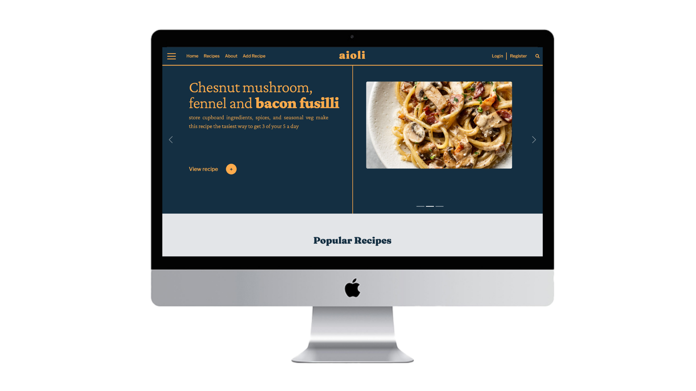
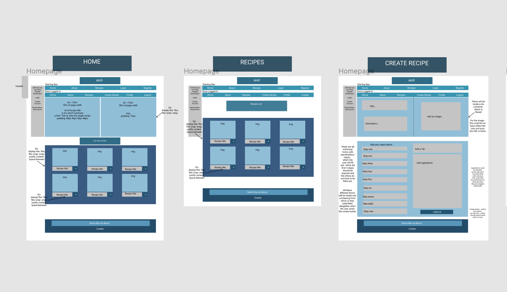
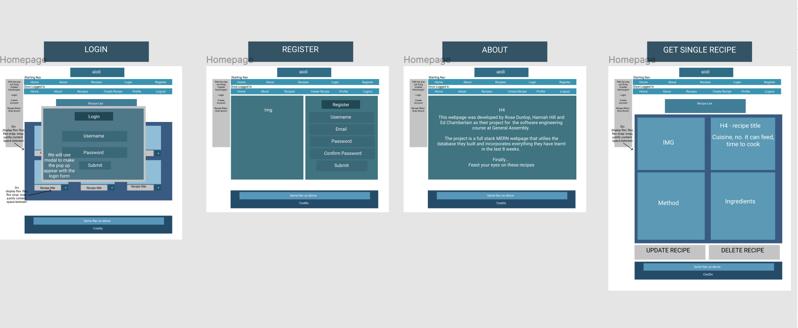
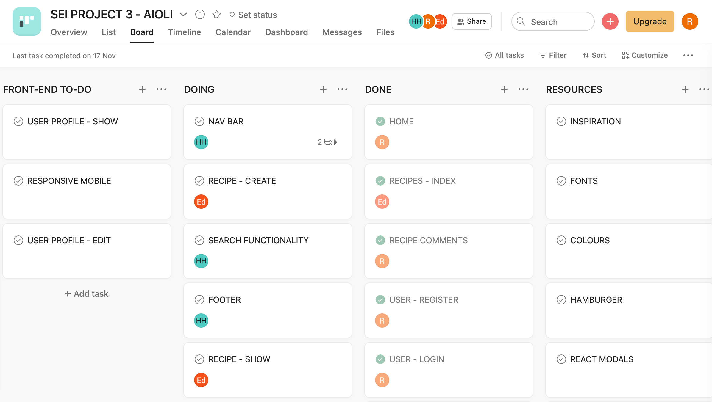
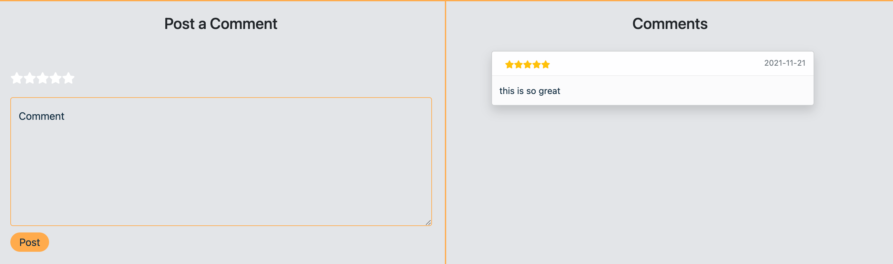
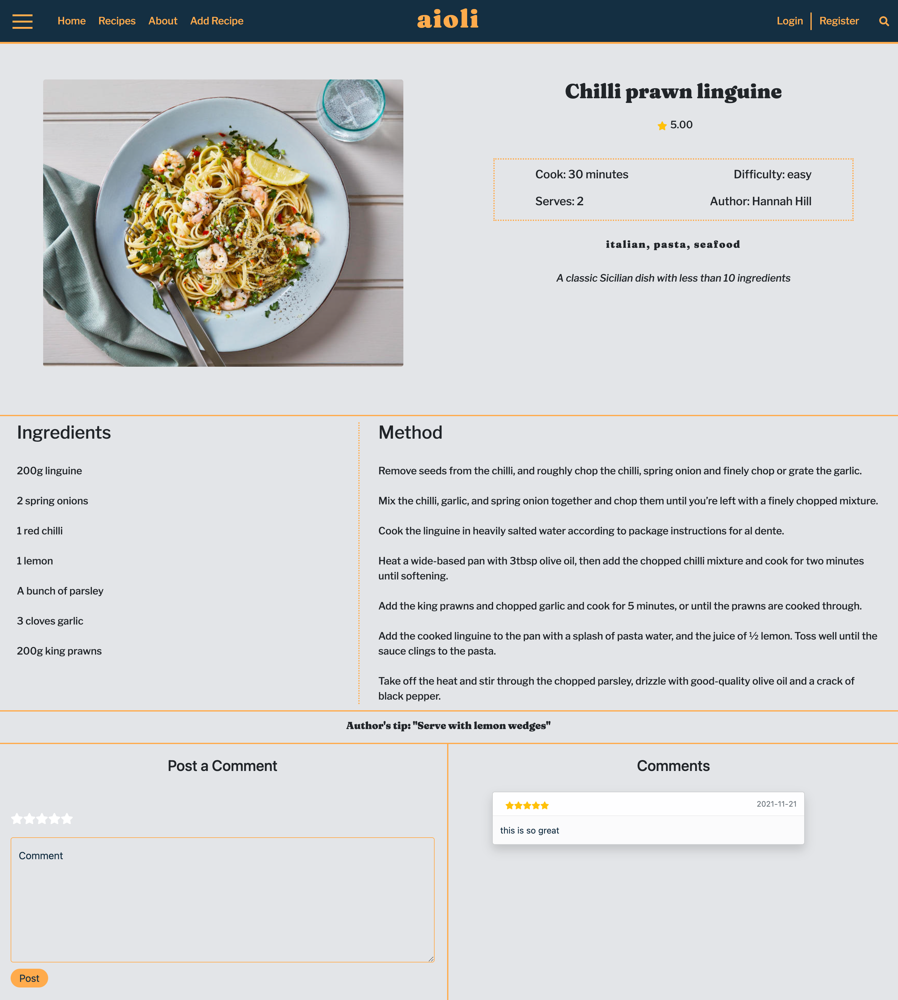
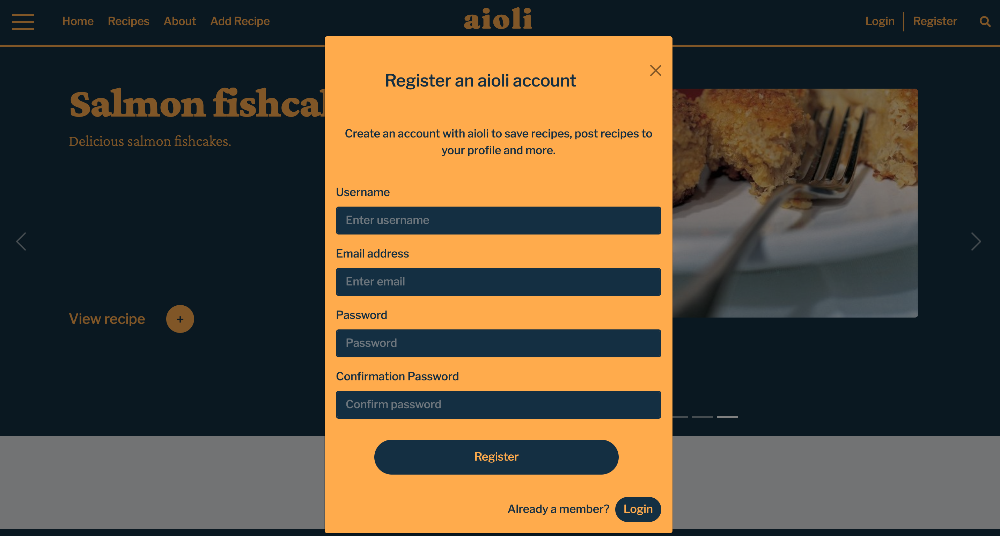
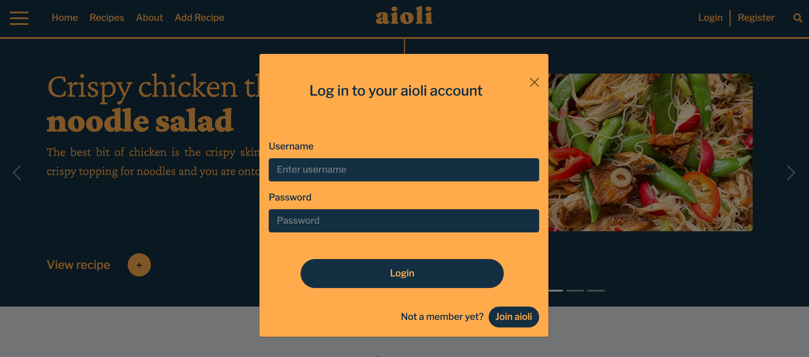
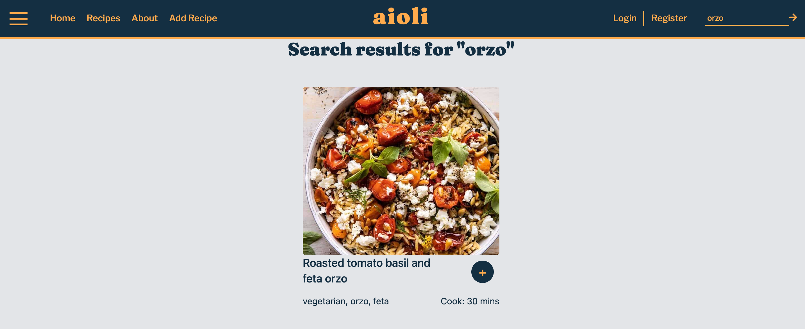

# Project 3 - Aioli

### Table of Contents

- Project Overview
- Brief
- Technologies Used
- Approach Taken
- Finished Product
- Bugs
- Challenges and Wins
- Future features and improvements
- Key Learnings

---

### Project Overview

Project three was my first experience creating a full-stack MERN application. There were three of us in my group and after some discussion we came up with the idea that we wanted to create a recipe app and we called it Aioli. This would be an app where users could browse our library of recipes, have an account, add their own recipes, review recipes and save favourite recipes to their account.



**You will find the deployed version here:** https://aioli-app.herokuapp.com/

If you wish to see all the features you can use these details below to login:

**username:** project-3
**password:** project-3

### Brief

- Build a full-stack MERN application - with your own front-end and back-end.
- Use an Express API to serve your data from a Mongo database.
- Make requests to your API in a separate front-end built with React.
- Must have CRUD functionality and ideally a situation where a user can login and register an account.
- Have completed wireframes and a detailed plan for how you are going to build your back-end: planned routes, schemas, models and relationships.
- Be successfully deployed online.

### Technologies Used

**_Back-End_**

- MongoDB
- Express
- Bcrypt
- Mongoose
- JSON Web Token
- Node.js

**_Front-End_**

- React
- Axios
- SASS
- React Bootstrap
- Http proxy middleware
- React Router Dom
- React Rating Stars Component
- React Icons
- Font Awesome Icons
- Cloudinary
- React Hamburger

**_Development Tools_**

- VScode
- Git
- GitHub
- Postman
- Asana
- Figma
- Heroku (deployment)

## Approach Taken

### Day One: Planning

After we had come up with our idea for the recipe app, we started setting out what we wanted each page and component to look like for the app. We also planned out what each of our routes, controllers and what the models would consist of. We ended up deciding to have two models: the User and the Recipe model.

**_Wireframes_**





After this we began to list tasks involved in both the back-end and the front-end that needed to be completed. We spent a decent amount of time discussing which areas we would work together on as a group and which tasks we would divide between us. We ended up deciding that we would create the back-end together to ensure we are all familiar with the models and then divide front-end tasks equally between us. We used Asana to keep track of what needed to be done:

---



As this was our first group project we decided that for the first few days of the project we would push to GitHub together to ensure that any merge conflicts were resolved correctly.

### Day Two - Building the Back-End:

When I began creating the recipe model, we had already discussed as a group what fields we wanted to have in it i.e. title, description and ingredients, which therefore made up the main structure of the schema. I then created a referenced relationship with the User model called ‘owner’ as we wanted each recipe to have an owner. Also in order for each recipe to have its own comment section, I created a new schema called commentSchema which had ratings, text and an owner - which again was a referenced relationship with the User model. I then created an embedded relationship between the comment schema and the recipe schema, by storing it under the key value of ‘comments’.

```
const likeSchema = new mongoose.Schema(
  {
    owner: { type: mongoose.Schema.ObjectId, ref: 'User', required: true }
  },
  {
    timestamps: true
  }
)

const commentSchema = new mongoose.Schema(
  {
    text: { type: String, required: true, maxlength: 200 },
    owner: { type: mongoose.Schema.ObjectId, ref: 'User', required: true },
    rating: { type: Number, required: true, min: 1, max: 5 }
  },
  {
    timestamps: true
  }
)

const recipeSchema = new mongoose.Schema({
  title: { type: String, required: true },
  image: { type: String },
  description: { type: String },
  method: [{ type: String, required: true }],
  ingredients: [{ type: String, required: true }],
  keywords: [{ type: String }],
  time: { type: Number, required: true },
  servings: { type: Number, required: true },
  tips: { type: String },
  difficulty: { type: String },
  author: { type: String },
  owner: { type: mongoose.Schema.ObjectId, ref: 'User', required: true },
  comments: [commentSchema],
  likes: [likeSchema]
})

```

For the recipe model I then created controllers for all CRUD actions revolving around recipes. I also created controllers for posting comments to a particular recipe too. I tested all routes in Postman to ensure the back-end was functioning how I wanted it to and that authorisation was required for post, put and delete requests. Here you can see some of the controllers I made for posting and deleting comments for a particular recipe:

```

// COMMENTS
export const addAComment = async (req, res) => {
  try {
    const { id } = req.params
    const recipe = await Recipe.findById(id)
    if (!recipe) throw new Error()
    const newComment = { ...req.body, owner: req.currentUser._id }
    console.log('newComment ->', newComment)
    recipe.comments.push(newComment)
    await recipe.save({ validateModifiedOnly: true })
    return res.status(200).json(recipe)
  } catch (err) {
    console.log(err)
    return res.status(404).json({ message: 'something went wrong' })
  }
}

//DELETE A COMMENT
export const deleteAComment = async (req, res) => {
  try {
    const { id, commentId } = req.params
    const recipe = await Recipe.findById(id)
    if (!recipe) throw new Error()
    const commentToDelete = recipe.comments.id(commentId)
    if (!commentToDelete) throw new Error()
    if (!commentToDelete.owner.equals(req.currentUser._id)) throw new Error()
    await commentToDelete.remove()
    await recipe.save({ validateModifiedOnly: true })
    return res.sendStatus(204)
  } catch (err) {
    console.log(err)
    return res.status(404).json({ message: 'something went wrong' })
  }
}

```

### Day 3-7 - Front-End:

After we had finished setting up the back-end and all our routes were working, we as a group set up our React app. Once we had installed all the packages we required and tested a request to our backend using http proxy middleware we split off and focussed on our individual tasks. My tasks included creating the home page, register, login and the comment sections on each recipe page.

### Home Page

For the Home page I wanted to showcase three random featured recipes from our database of recipes in a carousel to begin with. I also then wanted to showcase six featured/popular recipes that users could select and view if they liked the look of them. To do both of these things I firstly made a general get request for all the recipes from our back-end, and set the data from the response to a state variable which I could then use to display on the front end.

```

const Home = () => {
  const [recipes, setRecipes] = useState([])
  const [isLoading, setIsLoading] = useState(true)
  const [randomRecipes, setRandomRecipes] = useState([])

  useEffect(() => {
    const getAllRecipes = async () => {
      try {
        const { data } = await axios.get('/api/recipes')
        console.log(data)
        setRecipes(data)
        setIsLoading(false)
      } catch (err) {
        console.log(err)
      }
    }
    getAllRecipes()
  }, [])

  const filteredRecipes = recipes.slice(10, 16)

  useEffect(() => {
    if (!isLoading) {
      let r = []
      for (let i = 0; i < 3; i++) {
        const rn = Math.floor(Math.random() * recipes.length)
        const random = { ...recipes[rn] }
        console.log('eq', random === recipes[rn])
        random.title =
          random.title.charAt(0).toUpperCase() +
          random.title.slice(1).toLowerCase()
        random.title = random.title.split(' ')
        console.log('rt', random.title)
        r = [...r, random]
      }
      setRandomRecipes(r)
    }
  }, [isLoading])

```

I then manipulated the recipes array by firstly slicing out six recipes to be mapped out in the featured section and in order to have three random recipes displayed in the carousel a for loop was used to pick three random items out of the array. I used React Bootstrap for the carousel to make sure the styling of the carousel was professional, I felt this was important given that the home page is the first thing the user sees.

### Register and Login

For both the register and login components, I had multiple form inputs to create and make sure they hit the back-end properly using post requests. I therefore had to approach this task methodically due to complexity and scale of the task. I also had to use Local Storage to store the user’s token, if they successfully entered their details correctly. This was essential to our app's functionality, as it allowed us to restrict particular aspects of the website only to users who had accounts.

I also added logout functionality, which could only be accessed when a user was logged in, this was reliant on whether there was a token in local storage. I ended up making the navbar links responsive so that login and register would change to logout and account when a user was logged in.

I also decided to use React Bootstrap Modals as I felt they added to the slickness of the app and the user’s overall experience.

**_Login Code Snippet:_**

```

const handleSubmit = async (event) => {
    event.preventDefault()

    const data = {
      username,
      password
    }

    const config = {
      method: 'post',
      url: '/api/login',
      headers: {
        'Content-Type': 'application/json'
      },
      data: data
    }
    try {
      const response = await axios(config)
      console.log(response)

      setToken(response.data.token)
      setIsLoggedIn(true)
      setIsError(false)
      handleClose(true)
    } catch (err) {
      console.error(err)
      setIsError(true)
    }
  }

  const handleUsernameChange = (event) => {
    setUsername(event.target.value)
    console.log(username)
  }

  const handlePasswordChange = (event) => {
    setPassword(event.target.value)
    console.log(password)
  }

```

### Comments

For the comments section I had two components to make. First the form where a user would post a comment and second the area which would display the comments posted by the user.

For the posting of a comment I decided to use the FaStar component to create a hover effect when the user selects a rating. I felt that this was a nice to add feature and went beyond our MVP goal of just inputting a number between one and five. I also reset the state of the single recipe get request in order for the comment to be displayed on the page straight after it was posted - I felt this really added to the usability of the app.

For the displaying of the comments, which I showcased alongside the comment form, I used React Bootstrap toasts which looked really impressive on the page. I also mapped out the value of the rating in FaStar icons on the comment itself to add an extra feature to them.

**_Rating Code Snippet:_**

```
return (
    <div className="toast-comment">
      <h4>Comments</h4>
      {comments.map((comment) => (
      <ToastContainer key ={comment._id}>
        <Toast className='toast-main'>
        <Toast.Header>
          
          <strong className="me-auto">
            {[...Array(comment.rating)].map((star) => {
                return (
                  <FaStar key={star}/>
                )
            })}
          </strong>
          <small className="text-muted">{comment.createdAt.slice(0, 10)}</small>
        </Toast.Header>
       <Toast.Body>{comment.text}</Toast.Body>
       </Toast>
      </ToastContainer>
      ))}
    </div>
    )

```

### Day 8-9 - Stretch Goals/Styling:ß

One of our main stretch goals was having responsive mobile styling. I took on this task in the final couple of days we had left of the project and ensured that every page on the website had mobile styling to ensure that users could use the app on their mobiles too. I felt this was a really nice feature to have and added to the complexity and slickness of the app.

I also then put some work into the footer changing the style and the information displayed. I also ensured that the login and register links were responsive and would change to logout and account links when the user was logged in.

On the final day we all spent time removing console logs, making final styling improvements and reseeding our database. We also made final decisions on colour schemes and then implemented the colours into each page.

---

### Final Product

**_Homepage_**


**_Recipes Page_**


**_Comments_**



**_Single Recipe Page_**



**_Register_**



**_Login_**



**_Search_**



---

### Wins and Challenges

**_Wins_**

- One of the biggest wins for me personally is how well I managed to work in a group environment. I felt as though we all worked so well together and would always help each other if someone was struggling with what they were working on.
- I also found that because our group spent a lot of time planning together and assigning each other tasks on Asana, this removed the stress of a deadline and made the project really enjoyable to make.
- Another win was that I felt we made a really responsive app with great styling features. I was heavily involved in the styling of the app and was very happy with the outcome.

**_Challenges_**

- One of our biggest challenges as a group were proxy errors. We used http proxy middleware, however, it seemed to error on numerous occasions for each of us which did cause delays to our working schedule. We also never really found a solution to this issue, however, we knew that when it came down to deployment this would not be an issue.
- Another challenge for us as a group was the amount of form inputs we had when a user wanted to post a recipe. Ed took on this mammoth task and it was particularly time consuming for him. However, we found by coming together as a group and solving some of the issues he had with the multiple forms was really beneficial. So while this was a challenge, it taught me that coming together as a group and working together can save a lot of time.

### Bugs

- There are a few errors that need handling on the account page.
- We had a few difficulties with cloudinary image upload, where in some cases the images wouldn’t show up.

### Future Features and Improvements

- Facilitate ownership - at the moment any user can update or delete a recipe.
- Fix any existing bugs.

### Key Learnings

- One of my biggest takeaways from this project is how to work in a group. I felt as though we all worked so well together and were really good at communicating with one another which benefited us so much.
- I also found that I challenged myself on this project, as I am prone to shying away from trying out new things due to the possible risks of failure, but I found I really put myself out of my comfort zone and tried adding new features I had never come across before.
- I really felt that I consolidated all I had learnt on the course in this project and I really felt my confidence level increase after I finished the project.
